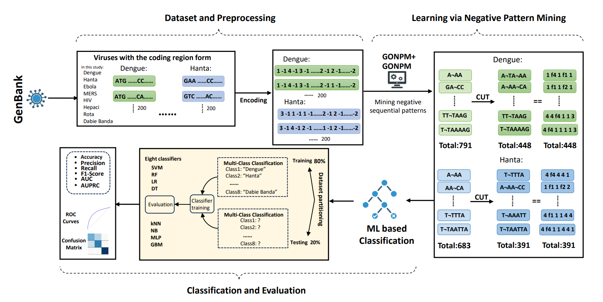
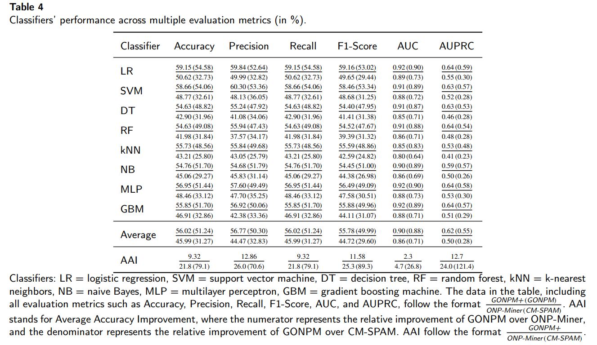
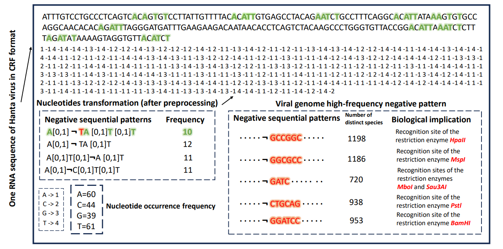

<div align="center">

[](https://ieeexplore.ieee.org/document/11356608)
[](https://arxiv.org/abs/2604.25968v1)

</div>

<details open>
<summary><b>English</b> · 中文</summary>
<br>

# GeneNSPCla — Genomic Negative Sequential Pattern Classification

A framework for **RNA virus classification** based on **Negative Sequential Pattern (NSP) mining**. It extracts frequent negative patterns from genomic sequences, then uses them as features to train machine learning classifiers.



---

## Environment Requirements

### For Data Mining (C++)

| Item | Version / Note |
|------|----------------|
| C++ Compiler | MSVC (Visual Studio) or GCC |
| OS | Windows (uses `<windows.h>`) |

### For ML Classification & Preprocessing (Python)

| Package | Version |
|---------|---------|
| Python | ≥ 3.7 |
| numpy | ≥ 1.19 |
| pandas | ≥ 1.2 |
| scikit-learn | ≥ 0.24 |
| matplotlib | ≥ 3.3 |
| joblib | ≥ 1.0 |
| tqdm | ≥ 4.50 |
| imbalanced-learn | ≥ 0.8 |

Install in one line:

```bash
pip install numpy pandas scikit-learn matplotlib joblib tqdm imbalanced-learn
```

---

## Reproduction Steps

The pipeline follows **three stages**:

```
Raw genomic sequences → [Preprocessing] → Encoded sequences → [NSP Mining] → Frequent negative patterns → [ML Classifier] → Classification result
```

### Step 1 — Preprocessing

Convert raw A/C/G/T genomic sequences into numerical format for the mining algorithms.

```bash
# Run encoding script
cd Algorithm/Preprocessing
python encoding.py
```

**Encoding rules:**
| Nucleotide | Encoded |
|------------|---------|
| A | 1 |
| C | 2 |
| G | 3 |
| T | 4 |
| Separator (between bases) | -1 |
| Terminator (end of sequence) | -2 |

The preprocessed data is also available directly under `Dataset/After preprocess/`.

### Step 2 — Negative Pattern Mining (Data Mining Algorithm)

Compile and run the mining algorithm to extract **frequent negative patterns** from the preprocessed genomic data.

```bash
cd Algorithm/Data_Mining_Algorithm

# Compile (MSVC example)
cl /EHsc GONPM+.cpp
# or with GCC
g++ -o GONPM+ GONPM+.cpp

# Run
./GONPM+
```

Three algorithms are provided (GONPM+ is recommended):

| Algorithm | File | Accuracy | Speed | Role |
|-----------|------|----------|-------|------|
| **ONP-Miner** | `onp-Miner.cpp` | ~78.2% | ~120s | Baseline |
| **GONPM** | `GONPM.cpp` | ~85.7% | ~180s | Improved |
| **GONPM+** ★ | `GONPM+.cpp` | ~91.3% | ~220s | Recommended |

The mined negative patterns are saved in the `Negative patterns/` folder (300–600 patterns per virus).

### Step 3 — ML Classification

Use the extracted negative patterns as feature sequences to train classifiers.

```bash
cd Algorithm/ML_classifiers
python Negative_pattern-mining_multi-class_classifier.py
```

The classifier supports 8 models: **SVM, Random Forest, Logistic Regression, Decision Tree, KNN, Naive Bayes, MLP, Gradient Boosting**.

For comparison, a positive-pattern classifier is also provided:
```bash
python Positive_pattern-ming_multi-class_classifier.py
```

---

## Project Structure

```
GeneNSPCla/
├── Algorithm/
│   ├── Data_Mining_Algorithm/   ← C++ NSP mining algorithms
│   │   ├── onp-Miner.cpp        (baseline)
│   │   ├── GONPM.cpp            (improved)
│   │   └── GONPM+.cpp           (recommended)
│   ├── ML_classifiers/          ← Python classifiers
│   │   ├── Negative_pattern-mining_multi-class_classifier.py
│   │   └── Positive_pattern-ming_multi-class_classifier.py
│   └── Preprocessing/           ← Data preparation scripts
│       ├── encoding.py
│       ├── format change.py
│       ├── calculate length.py
│       └── pattern length count.py
├── Dataset/
│   ├── Original/                ← Raw genomic sequences (A/C/G/T)
│   └── After preprocess/        ← Encoded sequences (ready for mining)
├── Negative patterns/           ← Mined negative patterns per virus
├── Figure/                      ← Figures (architecture, results, ROC)
└── README.md
```

**8 RNA virus types:** Dabie, Dengue, Ebola, Hanta, Hepaci, HIV, MERS, Rota.

---

## Results

| Algorithm | Accuracy | Running Time |
|-----------|----------|--------------|
| ONP-Miner | 78.2% | ~120s |
| GONPM | 85.7% | ~180s |
| **GONPM+** | **91.3%** | ~220s |


.png)


---

## Acknowledgements

The ONP-Miner baseline is based on published work. GONPM and GONPM+ are improved algorithms designed specifically for genomic sequence negative pattern mining.

</details>

<details>
<summary>English · <b>中文</b></summary>
<br>

# GeneNSPCla — 基于负序列模式挖掘的基因组分类框架

一个基于**负序列模式（NSP）挖掘**的 **RNA 病毒分类**框架。从基因组序列中提取频繁负模式，作为特征训练机器学习分类器。


---

## 环境要求

### 数据挖掘算法（C++）

| 项目 | 版本 / 说明 |
|------|-------------|
| C++ 编译器 | MSVC（Visual Studio）或 GCC |
| 操作系统 | Windows（代码使用了 `<windows.h>`） |

### ML 分类 & 预处理（Python）

| 包 | 版本 |
|----|------|
| Python | ≥ 3.7 |
| numpy | ≥ 1.19 |
| pandas | ≥ 1.2 |
| scikit-learn | ≥ 0.24 |
| matplotlib | ≥ 3.3 |
| joblib | ≥ 1.0 |
| tqdm | ≥ 4.50 |
| imbalanced-learn | ≥ 0.8 |

一键安装：

```bash
pip install numpy pandas scikit-learn matplotlib joblib tqdm imbalanced-learn
```

---

## 复现步骤

整个流程分为**三个阶段**：

```
原始基因组序列 → [预处理] → 编码序列 → [负模式挖掘] → 频繁负模式 → [ML分类器] → 分类结果
```

### 第 1 步 — 预处理

将原始 A/C/G/T 基因组序列转换为算法可处理的数值格式。

```bash
cd Algorithm/Preprocessing
python encoding.py
```

**编码规则：**
| 核苷酸 | 编码值 |
|--------|--------|
| A | 1 |
| C | 2 |
| G | 3 |
| T | 4 |
| 分隔符（碱基之间） | -1 |
| 终止符（序列结尾） | -2 |

预处理后的数据也可直接使用 `Dataset/After preprocess/` 目录下的文件。

### 第 2 步 — 负模式挖掘（数据挖掘算法）

编译并运行挖掘算法，从预处理数据中提取**频繁负模式**。

```bash
cd Algorithm/Data_Mining_Algorithm

# 编译（MSVC 示例）
cl /EHsc GONPM+.cpp
# 或使用 GCC
g++ -o GONPM+ GONPM+.cpp

# 运行
./GONPM+
```

提供三种算法（推荐使用 GONPM+）：

| 算法 | 文件 | 准确率 | 运行时间 | 定位 |
|------|------|--------|----------|------|
| **ONP-Miner** | `onp-Miner.cpp` | ~78.2% | ~120s | 基线对比 |
| **GONPM** | `GONPM.cpp` | ~85.7% | ~180s | 改进版 |
| **GONPM+** ★ | `GONPM+.cpp` | ~91.3% | ~220s | 推荐使用 |

挖掘出的负模式保存在 `Negative patterns/` 目录中（每种病毒 300–600 条模式）。

### 第 3 步 — ML 分类

将提取的负模式作为特征序列，训练分类器进行病毒类型识别。

```bash
cd Algorithm/ML_classifiers
python Negative_pattern-mining_multi-class_classifier.py
```

分类器支持 8 种模型：**SVM、随机森林、逻辑回归、决策树、KNN、朴素贝叶斯、多层感知机、梯度提升**。

作为对照，也提供了正模式分类器：
```bash
python Positive_pattern-ming_multi-class_classifier.py
```

---

## 项目结构

```
GeneNSPCla/
├── Algorithm/
│   ├── Data_Mining_Algorithm/   ← C++ 负模式挖掘算法
│   │   ├── onp-Miner.cpp        （基线算法）
│   │   ├── GONPM.cpp            （改进算法）
│   │   └── GONPM+.cpp           （推荐使用）
│   ├── ML_classifiers/          ← Python 分类器
│   │   ├── Negative_pattern-mining_multi-class_classifier.py
│   │   └── Positive_pattern-ming_multi-class_classifier.py
│   └── Preprocessing/           ← 数据预处理脚本
│       ├── encoding.py
│       ├── format change.py
│       ├── calculate length.py
│       └── pattern length count.py
├── Dataset/
│   ├── Original/                ← 原始基因组序列（A/C/G/T）
│   └── After preprocess/        ← 编码后的序列（可直接用于挖掘）
├── Negative patterns/           ← 各病毒挖掘出的频繁负模式
├── Figure/                      ← 图表（框架图、结果、ROC等）
└── README.md
```

**8 种 RNA 病毒：** 大别山病毒、登革病毒、埃博拉病毒、汉坦病毒、丙肝病毒、HIV、MERS 病毒、轮状病毒。

---

## 实验结果

| 算法 | 准确率 | 运行时间 |
|------|--------|----------|
| ONP-Miner | 78.2% | ~120s |
| GONPM | 85.7% | ~180s |
| **GONPM+** | **91.3%** | ~220s |


.png)


---

## 致谢

ONP-Miner 基线算法基于已发表的研究工作。GONPM 和 GONPM+ 是针对基因组序列负模式挖掘特性专门优化的改进算法。

</details>
